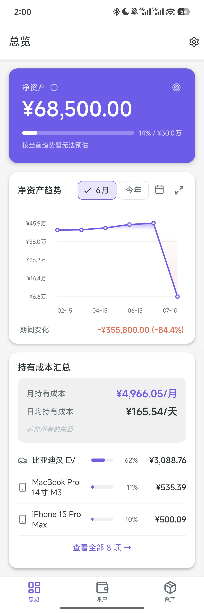
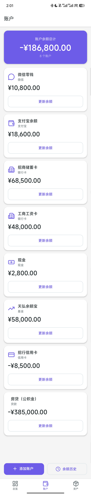
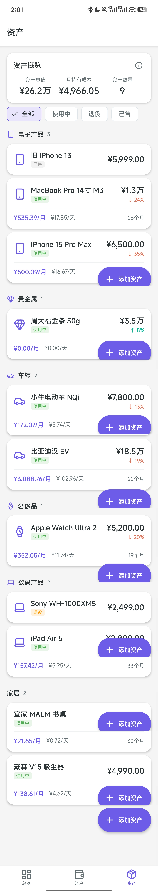
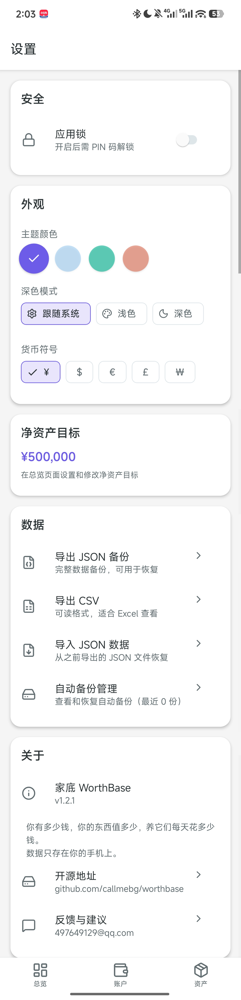
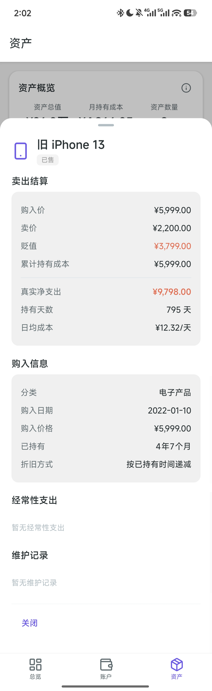
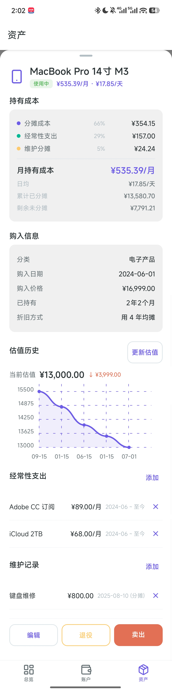
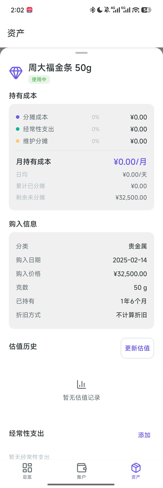
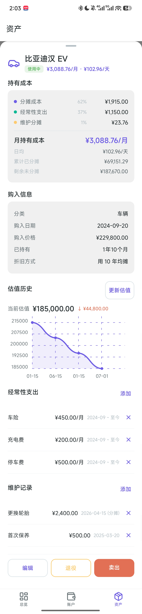

# WorthBase (家底)

<p align="center">
  <a href="./LICENSE"></a>
  <a href="https://github.com/callmebg/worthbase/releases"></a>
  
  
  <a href="./CONTRIBUTING.md"></a>
</p>

> How much money do you have across accounts? What are your things worth? How much does it cost to own them all?

A **privacy-first, fully offline** personal net worth tracker. No transaction logging — instead, it answers three core questions:

1. **How much money do I have** — Multi-account balance overview with periodic manual updates
2. **What are my things worth** — Physical asset valuation tracking + holding cost calculation
3. **How is my net worth trending** — Historical snapshot charts and goal progress tracking

📖 English | [中文](./README.md)

---

## Screenshots

<p align="center">
  
  
  
  
</p>

---

## Features

### Account Balance Management
- Supports 6 account types: WeChat Pay, Alipay, bank cards, cash, funds, and other
- Periodic manual balance updates, each saved as a snapshot
- Multi-account balance summary with one-tap total

### Net Worth Trend Analysis
- Net worth trend line chart with pinch-to-zoom and pan-to-drag gestures
- Net worth = Liquid assets + Asset valuations − Unamortized purchase costs
- Net worth goal setting with progress bar visualization

### Physical Asset Management
- 8 asset categories: Vehicles, Real Estate, Electronics, Digital, Furniture, Appliances, Luxury, Other
- Full asset lifecycle: In Use → Retired / Sold
- Valuation tracking with optional history curve
- Sell settlement: auto-calculates purchase price, sell price, depreciation, cumulative holding cost, net spend, daily cost

### Holding Cost Calculation (Key Feature)
4 depreciation methods, freely selectable per asset:

| Method | Formula | Characteristic |
|--------|---------|----------------|
| Simple Linear | Purchase Price ÷ Months Owned | Monthly cost decreases over time |
| Expected Lifespan | Purchase Price ÷ Expected Months | Fixed monthly cost |
| Residual Value | (Purchase Price − Residual Value) ÷ Expected Months | Fixed, accounts for residual value |
| No Depreciation | 0 | Only recurring expenses and maintenance |

Holding cost = Depreciation + Recurring expenses (active items for current month) + One-time maintenance (amortized if selected)

- **Recurring expenses**: Phone bills, fuel, insurance, etc. with effective date ranges
- **One-time maintenance**: Repairs, servicing — optionally included in cost allocation
- **Monthly & daily views**: See both monthly holding cost and daily cost
- **Summary panel**: Total monthly holding cost across all assets

<p align="center">
  
  
  
  
</p>

### Data Security
- **Fully local storage**: No server, no registration, no data upload
- **App lock**: PIN + biometric authentication (fingerprint / Face ID)
- **Auto backup**: Automatic SQLite database backup on app exit (keeps last 3)
- **Import/Export**: JSON (full backup) and CSV (readable export) formats, with preview and merge/replace strategies on import

### Appearance
- Dark mode (follows system / light / dark)
- 4 theme colors (purple / blue / green / orange)
- Material Design 3 design language (via react-native-paper)
- Customizable currency symbol

---

## Tech Stack

| Category | Technology |
|----------|------------|
| Framework | React Native 0.86 + Expo SDK 57 |
| Language | TypeScript 6.0 |
| Routing | Expo Router (File-based) |
| Database | expo-sqlite (SQLite) |
| State Management | Zustand |
| UI Components | react-native-paper (Material Design 3) |
| Charts | react-native-chart-kit + react-native-svg |
| Icons | lucide-react-native |
| Gestures | react-native-gesture-handler + react-native-reanimated |
| Bottom Sheet | @gorhom/bottom-sheet |
| Security | expo-local-authentication + expo-secure-store |
| Build Tool | EAS Build |
| Testing | Jest + ts-jest + @testing-library/react-native |

---

## Quick Start

### Prerequisites

- Node.js >= 20 (project includes `.nvmrc`, recommend [nvm](https://github.com/nvm-sh/nvm) for version management)
- npm
- Android Studio (for local Android builds, includes JDK 17+)
- Xcode (macOS only, for local iOS builds)

### Install Dependencies

```bash
git clone https://github.com/callmebg/worthbase.git
cd worthbase
npm install
```

### Development Mode

The fastest way — no native compilation needed:

```bash
npm start
```

Then install **Expo Go** on your phone and scan the QR code from the terminal.

### Platform-Specific

```bash
# Android (requires connected emulator or device)
npm run android

# iOS (macOS only, requires Xcode)
npm run ios
```

---

## Download

| Platform | Method |
|----------|--------|
| Android | Download APK from [GitHub Releases](https://github.com/callmebg/worthbase/releases) |
| iOS | Self-build via EAS (Apple distribution restrictions) |

---

## Building

### EAS Cloud Build (Recommended)

No local Android Studio / Xcode needed:

```bash
npm install -g eas-cli
eas login
eas build --profile preview --platform android
eas build --profile preview --platform ios
```

`eas.json` includes three build profiles:

| Profile | Purpose | Android | iOS |
|---------|---------|---------|-----|
| development | Dev & debug | APK | Simulator |
| preview | Internal testing | APK | — |
| production | Store release | AAB (App Bundle) | IPA |

### Local Build

```bash
# Generate native project
npx expo prebuild --platform android

# Build Release APK (universal, all architectures, larger size)
cd android && ./gradlew assembleRelease

# Build for specific architecture (recommended, smaller size)
./gradlew assembleRelease -PreactNativeArchitectures=arm64-v8a      # 64-bit only (modern devices)
./gradlew assembleRelease -PreactNativeArchitectures=armeabi-v7a   # 32-bit only (legacy devices)
./gradlew assembleRelease -PreactNativeArchitectures=arm64-v8a,armeabi-v7a  # Both architectures
```

> Requires `JAVA_HOME` pointing to JDK 17+ and `ANDROID_HOME` set to Android SDK.
> Specifying a single architecture reduces APK size from ~150 MB to ~65 MB.

---

## Testing

```bash
npm test
```

Runs 7 test suites with 158 unit tests, covering:

- Holding cost calculation engine (4 depreciation strategies, recurring expense intervals, sell settlement, maintenance allocation)
- Database Repository layer CRUD
- Zustand Store state management
- Data services (backup / export / import)
- UI component rendering
- Authentication service
- Engine boundary conditions

---

## Project Structure

```
worthbase/
├── app/                        # Page routes (Expo Router)
│   ├── _layout.tsx             #   Root layout (Tab nav + AppState auto-backup)
│   ├── index.tsx               #   Dashboard (net worth + trend chart + holding cost summary)
│   ├── accounts.tsx            #   Account management
│   ├── assets.tsx              #   Asset management
│   └── settings.tsx            #   Settings
├── src/
│   ├── components/             # UI components
│   │   ├── ui/                 #   Base UI kit (Button, Card, Chip, FAB, BottomSheet, etc.)
│   │   ├── AddAssetModal.tsx   #   3-step add asset form
│   │   ├── DatePickerField.tsx #   Date picker component
│   │   ├── TimeRangeSheet.tsx  #   Time range selection bottom sheet
│   │   ├── AssetDetailModal.tsx#   Asset detail modal
│   │   ├── SettlementModal.tsx #   Sell settlement modal
│   │   ├── HoldingCostBreakdown.tsx # 3-layer holding cost breakdown
│   │   ├── InteractiveTrendChart.tsx # Interactive trend chart (zoom/drag)
│   │   ├── ValuationChart.tsx  #   Valuation history chart
│   │   ├── OnboardingView.tsx  #   First-run onboarding
│   │   └── LockScreen.tsx      #   App lock screen
│   ├── db/                     # Database layer (SQLite)
│   │   ├── schema.ts           #   7 tables + indexes
│   │   ├── client.ts           #   SQLite connection
│   │   ├── migrations.ts       #   Migration management
│   │   └── *-repository.ts     #   Per-table Repository (CRUD)
│   ├── engine/                 # Calculation engine (strategy pattern)
│   │   ├── strategies/         #   4 depreciation strategy implementations
│   │   ├── HoldingCostCalculator.ts       # Holding cost aggregation
│   │   ├── NetWorthCalculator.ts          # Net worth calculation
│   │   ├── SettlementCalculator.ts        # Sell settlement
│   │   ├── RecurringExpenseCalculator.ts  # Recurring expense intervals
│   │   └── MaintenanceCalculator.ts       # Maintenance allocation
│   ├── stores/                 # Zustand state (account / asset / settings)
│   ├── services/               # Data services (backup / export / import / auth)
│   ├── hooks/                  # Custom Hooks (database init)
│   ├── theme/                  # Theme system (colors / typography / spacing / icons / tokens)
│   ├── types/                  # Type definitions (enums, models)
│   └── utils/                  # Utilities (crypto / formatting / validation)
├── __tests__/                  # Unit tests (7 suites / 158 cases)
│   ├── helpers/                #   Test utilities (mock-database, etc.)
├── assets/                     # App icons and splash screen
├── app.json                    # Expo config
├── eas.json                    # EAS Build config
├── jest.config.js              # Jest config
└── tsconfig.json               # TypeScript config
```

### Architecture

```
┌─────────────────────────────────────────────────────┐
│                    UI Layer                          │
│  app/*.tsx + src/components/                         │
│  Expo Router 4-Tab nav + Paper MD3 components        │
├─────────────────────────────────────────────────────┤
│                  State Layer                         │
│  src/stores/ (Zustand)                               │
│  account-store · asset-store · settings-store        │
├─────────────────────────────────────────────────────┤
│                   Engine Layer                       │
│  src/engine/                                         │
│  ┌─────────────┐  ┌──────────────┐  ┌────────────┐ │
│  │ Depreciation│  │ Recurring    │  │ Maintenance │ │
│  │ (4 impls)   │  │ (intervals)  │  │ (alloc.)    │ │
│  └─────────────┘  └──────────────┘  └────────────┘ │
│  Holding cost = Depreciation + Recurring + Maint.    │
├─────────────────────────────────────────────────────┤
│                   Data Layer                         │
│  src/db/ (expo-sqlite)                               │
│  7 tables: accounts · balance_snapshots · assets ·   │
│  recurring_expenses · maintenance_records ·          │
│  valuation_history · settings                        │
└─────────────────────────────────────────────────────┘
```

The engine computes everything **in real-time** — no pre-stored results. Costs, accumulated totals, and remaining values are dynamically calculated based on the current date every time a page loads.

---

## Contributing

Issues and Pull Requests are welcome! See [CONTRIBUTING.md](./CONTRIBUTING.md) for details.

For security issues, please see [SECURITY.md](./SECURITY.md).

### Dev Conventions
- TypeScript strict mode
- Path alias `@/` → `src/`
- Extend the calculation engine by implementing strategy interfaces (see `src/engine/strategies/`)
- New features should include unit tests

---

## Development Guide

### Adding a New Depreciation Strategy

1. Create a new strategy file in `src/engine/strategies/`, implementing the `AmortizationStrategy` interface:

```typescript
// src/engine/strategies/MyNewStrategy.ts
import type { AmortizationStrategy } from './AmortizationStrategy';
import type { Asset } from '@/types/models';

export const MyNewStrategy: AmortizationStrategy = {
  calculateMonthlyCost(asset: Asset, currentDate: Date): number { /* ... */ },
  calculateAccumulated(asset: Asset, currentDate: Date): number { /* ... */ },
  calculateRemaining(asset: Asset, currentDate: Date): number { /* ... */ },
};
```

2. Add the new type to `AmortizationType` enum in `src/types/enums.ts`
3. Register it in the `strategyMap` in `src/engine/strategies/index.ts`
4. Add unit tests in `__tests__/engine.test.ts`

### Database Migrations

When modifying the schema, add a new migration in `src/db/migrations.ts`:

```typescript
{
  version: 3,                // Increment version number
  description: 'Describe the change',
  up: async (db) => {
    await db.execAsync(`ALTER TABLE xxx ADD COLUMN yyy TEXT;`);
  },
},
```

Migrations must be **idempotent** (safe to run multiple times). Update the `CURRENT_VERSION` constant accordingly.

### Bumping the Version Number

When releasing a new version, update these **4 files in sync**:

| # | File | Field | Purpose |
|---|------|-------|---------|
| 1 | `package.json` | `"version"` | npm package version |
| 2 | `app.json` | `"version"` | Expo config, propagated to native builds |
| 3 | `android/app/build.gradle` | `versionName` | Android APK display version |
| 4 | `app/settings.tsx` | `description="v..."` | Settings → About section (hardcoded string) |

Also consider:

| # | File | Field | Note |
|---|------|-------|------|
| 5 | `android/app/build.gradle` | `versionCode` | Android internal version code — **must increment** for each Play Store release |
| 6 | `CHANGELOG.md` | New entry | Document changes for the release |

> **Note**: `CURRENT_VERSION` in `src/db/migrations.ts` is the database schema version, and `version` in `src/services/export-service.ts` is the export format version. Neither is related to the app version — only update them when the data structure changes.

### Code Conventions
- Run tests: `npm test`
- TypeScript strict mode, path alias `@/` → `src/`
- New features should include unit tests to maintain coverage

---

## License

[MIT](./LICENSE) © callmebg

---

## Star History

[](https://star-history.com/#callmebg/worthbase)
